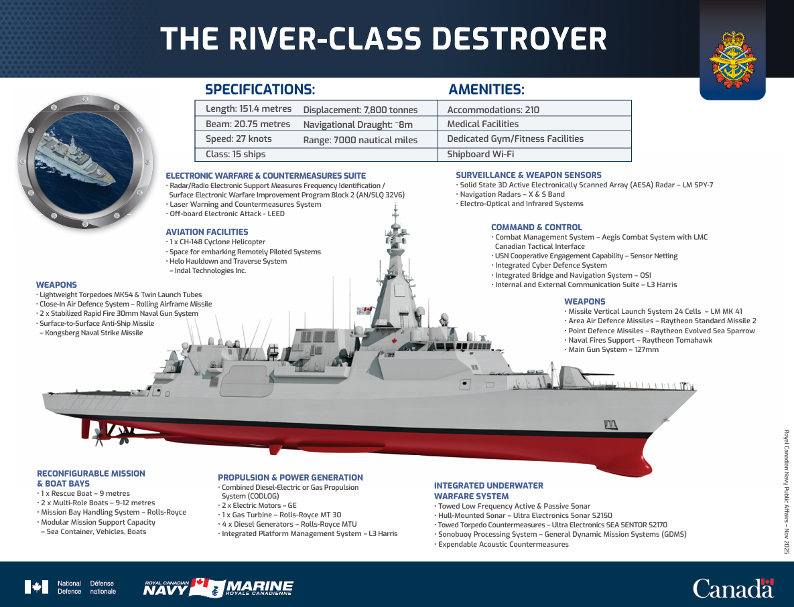

# River-Class Destroyer Supply-Chain Analysis

This project is an independent research exercise examining the River-class
destroyer being built for the Royal Canadian Navy. It explores where the
vessels' major systems, components, materials, and equipment are expected to
come from, with particular attention to the amount of Canadian content.

The analysis ranges from major systems such as propulsion, weapons, sensors,
and combat management equipment to lower-level materials and components where
public information is available. It also groups identified suppliers and
components by country and includes an initial attempt to estimate costs.

> [!IMPORTANT]
> This is an independent, open-source analysis. It is not an official
> Government of Canada bill of materials or supplier list. Some sourcing
> locations and percentages are estimates based on publicly available
> information and may change as the program develops.

## Vessel Overview



[View the official River-class destroyer fact sheet PDF on Canada.ca](https://www.canada.ca/content/dam/rcn-mrc/documents/ships/river-class-factsheet-2026.pdf)

The River-class will be a class of 15 guided-missile destroyers based on the
Type 26 design. The ships will replace the Royal Canadian Navy's retired
Iroquois-class destroyers and Halifax-class frigates. They are planned to be
built at Irving Shipbuilding's Halifax Shipyard under Canada's National
Shipbuilding Strategy.

Official project information:

- [Canadian Surface Combatant / River-class destroyer procurement project](https://www.canada.ca/en/department-national-defence/services/procurement/canadian-surface-combatant.html)
- [Royal Canadian Navy River-class destroyer overview](https://www.canada.ca/en/navy/corporate/fleet-units/surface/river-class-destroyer.html)
- [Royal Canadian Navy River-class destroyer fact sheet](https://www.canada.ca/en/navy/corporate/fleet-units/surface/river-class-destroyer/fact-sheet.html)

## Research Reports

| Report | Description |
| --- | --- |
| [Canada River Class Component Detail.pdf](Canada%20River%20Class%20Component%20Detail.pdf) | Detailed review of known and probable River-class destroyer components, systems, manufacturers, and sourcing information. |
| [Canada River Class Component by Country Detail.pdf](Canada%20River%20Class%20Component%20by%20Country%20Detail.pdf) | Detailed country-by-country breakdown of identified vessel components and their associated suppliers or sourcing locations. |
| [Canada River Class Component by Country Summary.pdf](Canada%20River%20Class%20Component%20by%20Country%20Summary.pdf) | Condensed summary of component sourcing by country, including estimated shares of vessel materials and equipment. |
| [Canada River Class Cost Attempt.pdf](Canada%20River%20Class%20Cost%20Attempt.pdf) | Initial attempt to estimate and organize River-class destroyer costs using publicly available information. |

For the sourcing analysis, a component's assigned country may represent the
supplier's headquarters, design origin, known manufacturing location, or a
best-supported estimate. These are not always the same place.

## Research Questions

The reports were created to investigate:

- Which companies and countries supply the destroyer's major systems?
- Where are propulsion systems, engines, weapons, sensors, and combat systems
  designed and manufactured?
- What is known about the origin of structural materials, fittings, and
  lower-level components such as fasteners?
- How much of the vessel can reasonably be considered Canadian content?
- What percentage of identified components or materials can be attributed to
  each country?
- What can public information reveal about the program's costs?

## Research Approach

The component analysis began with an exhaustive online search using Government
of Canada project pages and the Royal Canadian Navy fact sheet as primary
starting points. Public manufacturer information, announcements, reporting,
and other open sources were then used to identify suppliers and likely
production locations.

The country summary was produced from the component research by organizing
identified systems and materials by sourcing location and estimating each
country's share where sufficient information was available.

## Starting Sources

- [Government of Canada: Canadian Surface Combatant procurement](https://www.canada.ca/en/department-national-defence/services/procurement/canadian-surface-combatant.html)
- [Royal Canadian Navy: River-class destroyer](https://www.canada.ca/en/navy/corporate/fleet-units/surface/river-class-destroyer.html)
- [Royal Canadian Navy: River-class destroyer fact sheet](https://www.canada.ca/en/navy/corporate/fleet-units/surface/river-class-destroyer/fact-sheet.html)
- [Wikipedia: River-class destroyer (2030s)](https://en.wikipedia.org/wiki/River-class_destroyer_(2030s))
- [Naval News: Canada celebrates keel laying for the first River-class destroyer](https://www.navalnews.com/naval-news/2026/06/canada-celebrates-keel-laying-for-the-first-river-class-destroyer/)

## Repository

Clone over SSH:

```bash
git clone git@github.com:sitrucp/rcn_river_class_destroyer.git
```

GitHub: [sitrucp/rcn_river_class_destroyer](https://github.com/sitrucp/rcn_river_class_destroyer)

